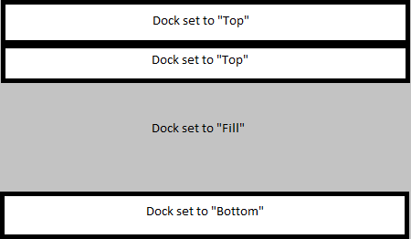
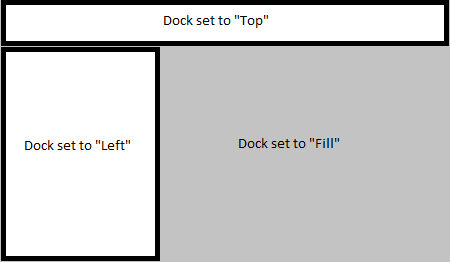

# winc

** This is a fork of [tadvi/winc](https://github.com/tadvi/winc) for the sole purpose of integration
with [Wails](https://github.com/gcfguo/wails). This repository comes with ***no support*** **

Common library for Go GUI apps on Windows. It is for Windows OS only. This makes library smaller than some other UI
libraries for Go.

Design goals: minimalism and simplicity.

## Dependencies

No other dependencies except Go standard library.

## Building

If you want to package icon files and other resources into binary **rsrc** tool is recommended:

	rsrc -manifest app.manifest -ico=app.ico,application_edit.ico,application_error.ico -o rsrc.syso

Here app.manifest is XML file in format:

```
<?xml version="1.0" encoding="UTF-8" standalone="yes"?>
<assembly xmlns="urn:schemas-microsoft-com:asm.v1" manifestVersion="1.0">
    <assemblyIdentity version="1.0.0.0" processorArchitecture="*" name="App" type="win32"/>
    <dependency>
        <dependentAssembly>
            <assemblyIdentity type="win32" name="Microsoft.Windows.Common-Controls" version="6.0.0.0" processorArchitecture="*" publicKeyToken="6595b64144ccf1df" language="*"/>
        </dependentAssembly>
    </dependency>
</assembly>
```

Most Windows applications do not display command prompt. Build your Go project with flag to indicate that it is Windows
GUI binary:

	go build -ldflags="-H windowsgui"

## Samples

Best way to learn how to use the library is to look at the included **examples** projects.

## Setup

1. Make sure you have a working Go installation and build environment, see more for details on page below.
   http://golang.org/doc/install

2. go get github.com/gcfguo/wails/v2/internal/frontend/desktop/windows/winc

## Icons

When rsrc is used to pack icons into binary it displays IDs of the packed icons.

```
rsrc -manifest app.manifest -ico=app.ico,lightning.ico,edit.ico,application_error.ico -o rsrc.syso
Manifest ID:  1
Icon  app.ico  ID:  10
Icon  lightning.ico  ID:  13
Icon  edit.ico  ID:  16
Icon  application_error.ico  ID:  19
```

Use IDs to reference packed icons.

```
const myIcon = 13

btn.SetResIcon(myIcon) // Set icon on the button.
```

Included source **examples** use basic building via `release.bat` files. Note that icon IDs are order dependent. So if
you change they order in -ico flag then icon IDs will be different. If you want to keep order the same, just add new
icons to the end of -ico comma separated list.

## Layout Manager

SimpleDock is default layout manager.

Current design of docking and split views allows building simple apps but if you need to have multiple split views in
few different directions you might need to create your own layout manager.

Important point is to have **one** control inside SimpleDock set to dock as **Fill**. Controls that are not set to any
docking get placed using SetPos() function. So you can have Panel set to dock at the Top and then have another dock to
arrange controls inside that Panel or have controls placed using SetPos() at fixed positions.



This is basic layout. Instead of toolbars and status bar you can have Panel or any other control that can resize. Panel
can have its own internal Dock that will arrange other controls inside of it.



This is layout with extra control(s) on the left. Left side is usually treeview or listview.

The rule is simple: you either dock controls using SimpleDock OR use SetPos() to set them at fixed positions. That's it.

At some point **winc** may get more sophisticated layout manager.

## Dialog Screens

Dialog screens are not based on Windows resource files (.rc). They are just windows with controls placed at fixed
coordinates. This works fine for dialog screens up to 10-14 controls.

# Minimal Demo

```
package main

import (
	"github.com/gcfguo/wails/v2/internal/frontend/desktop/windows/winc"
)

func main() {
	mainWindow := winc.NewForm(nil)
	mainWindow.SetSize(400, 300)  // (width, height)
	mainWindow.SetText("Hello World Demo")

	edt := winc.NewEdit(mainWindow)
	edt.SetPos(10, 20)
	// Most Controls have default size unless SetSize is called.
	edt.SetText("edit text")

	btn := winc.NewPushButton(mainWindow)
	btn.SetText("Show or Hide")
	btn.SetPos(40, 50)	// (x, y)
	btn.SetSize(100, 40) // (width, height)
	btn.OnClick().Bind(func(e *winc.Event) {
		if edt.Visible() {
			edt.Hide()
		} else {
			edt.Show()
		}
	})

	mainWindow.Center()
	mainWindow.Show()
	mainWindow.OnClose().Bind(wndOnClose)

	winc.RunMainLoop() // Must call to start event loop.
}

func wndOnClose(arg *winc.Event) {
	winc.Exit()
}
```


Result of running sample_minimal.

## Create Your Own

It is good practice to create your own controls based on existing structures and event model. Library contains some of
the controls built that way: IconButton (button.go), ErrorPanel (panel.go), MultiEdit (edit.go), etc. Please look at
existing controls as examples before building your own.

When designing your own controls keep in mind that types have to be converted from Go into Win32 API and back. This is
usually due to string UTF8 and UTF16 conversions. But there are other types of conversions too.

When developing your own controls you might also need to:

	import "github.com/gcfguo/wails/v2/internal/frontend/desktop/windows/winc/w32"

w32 has Win32 API low level constants and functions.

Look at **sample_control** for example of custom built window.

## Companion Package

[Go package for Windows Systray icon, menu and notifications](https://github.com/tadvi/systray)

## Credits

This library is built on

[AllenDang/gform Windows GUI framework for Go](https://github.com/AllenDang/gform)

**winc** takes most design decisions from **gform** and adds many more controls and code samples to it.


